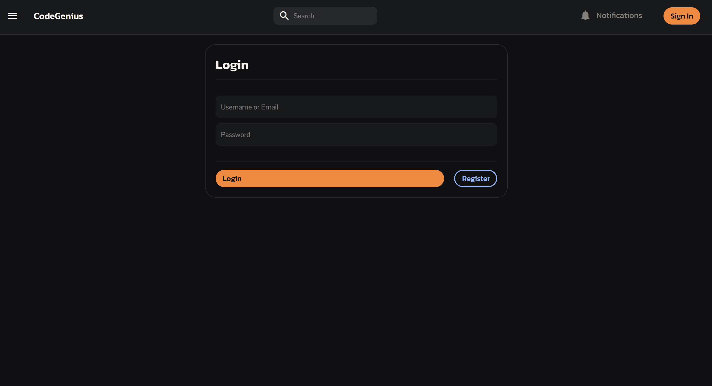
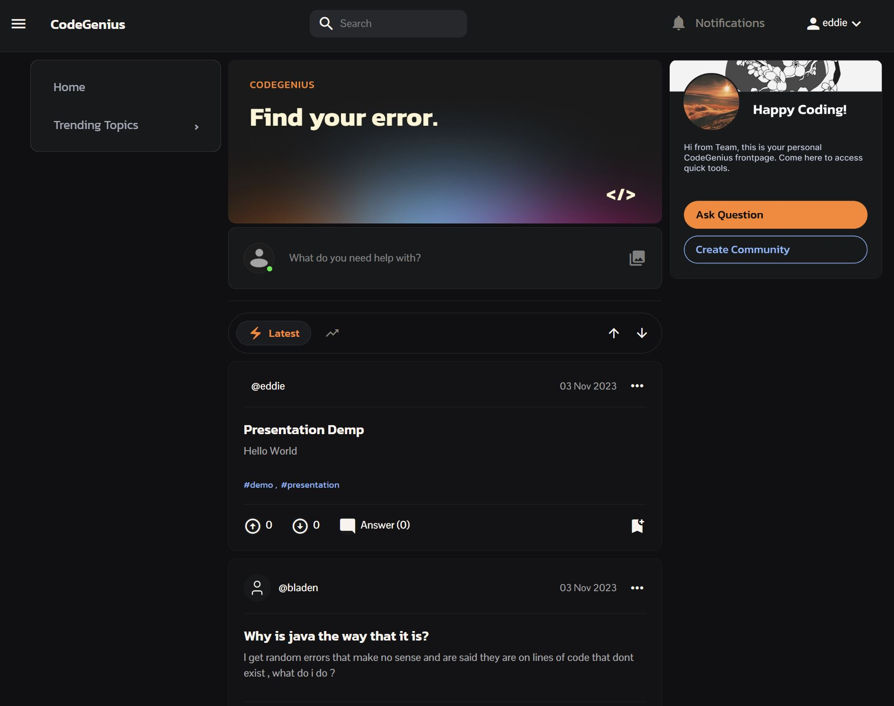
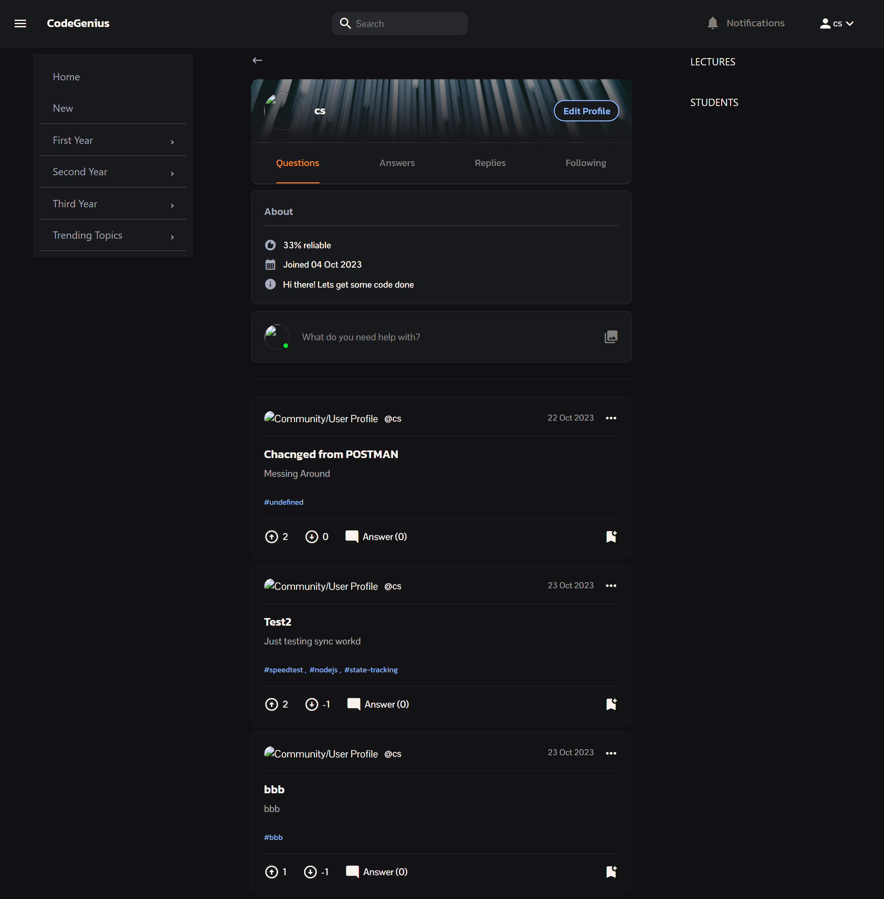
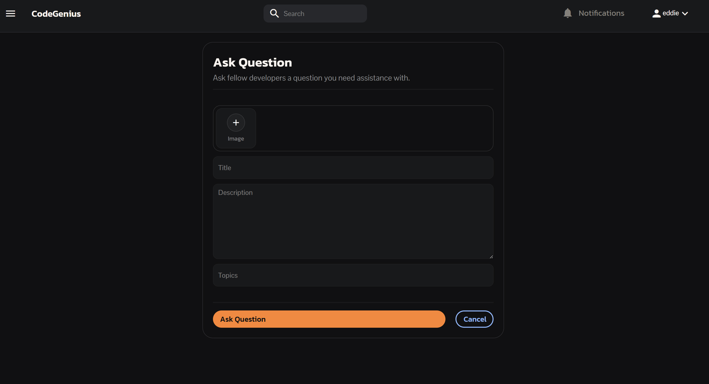
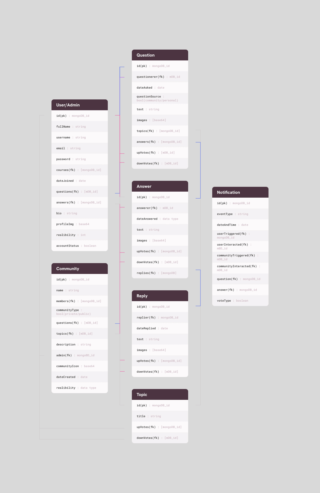

<a name="readme-top"></a>
[![Contributors][contributors-shield]][contributors-url] 
[![Forks][Forks]][Forks-url]
[![Starsgazers][Stars]][Stars-url]
# 
<div align="center">
  <a href="https://github.com/CSWilder02/Term-4-Group-2---Project">
    " width="200" height="auto">
  </a>

  <h3 align="center">CodeGenius </h3>

  <p align="center">
    The Future of Development QNA for anyone with a Coding problem 
    <br />
    <a href="https://github.com/CSWilder02/Term-4-Group-2---Project/tree/main/Class%20Work"><strong>Explore the docs »</strong></a>
    <br />
    <br />
    <a href="add The demo Video Link here">View Demo</a>
    ·
    <a href="bug report link">Report Bug</a>
    ·
    <a href="Maybe">Request Feature</a>
  </p>
  <br />
</div>


## Mockup


## About this Project


CodeGenius is a robust and fully-developed Full MERN Stack Application that serves as a dynamic platform for fostering collaboration between students and lecturers. With a focus on facilitating the exchange of development-specific knowledge and expertise, CodeGenius empowers users to post questions, provide answers, and engage in a rich learning environment.

## Table of Contents


-  [Built With](#built-with)

-  [Prerequisites](#Prerequisites)

-  [Installation](#installation)

-  [UI Designs](#ui-designs)

-  [Credits](#credits)

-  [Features](#features)

-  [Development Process](#Development-Process)


### Built With
* [![React][React.js]][React-url]
* [![Express][Express.js]][Express-url]
* [![Mongodb][MongoDB]][MongoDB-url]
* [![jwt][JWT]][jwt-url]
* [![bootstrap][Bootstrap]][Bootstrap-url]
* [![nodemon][Nodemon]][Nodemon-url]
<p align="right">(<a href="#readme-top">back to top</a>)</p>

## Getting Started
### Prerequisites

For development, you require to create an account on [Mongodb](https://www.mongodb.com/).

### Installation


1. Clone the repo
   ```sh
   git clone https://github.com/CSWilder02/Term-4-Group-2---Project.git
   ```
2. Install NPM packages
   ```sh
   npm install
   ```
3. Start the client server in `client/term4-group2-qna`
   ```sh
   npm start
   ```
4. Start the backend server in `server` file
   ```sh
   npm run dev
   ```

<p align="right">(<a href="#readme-top">back to top</a>)</p>

## UI Designs


Log In


Home Page


Profile Page


Single Question Page with Answers


Create Question Page
 

## Credits

#### Main Collaborators

<div style="display: flex; justify-content: space-between;">
  <div style="text-align: center;">
    <a href="https://github.com/eddiesosera/Term-4-Group-2---Project">
      
    </a>
    <br>
    <sub>Eddie Sosera</sub>
  </div>
  
  <div style="text-align: center;">
    <a href="https://github.com/CSWilder02/Term-4-Group-2---Project">
      
    </a>
    <br>
    <sub>CS Strijdom</sub>
  </div>
  
  <div style="text-align: center;">
    <a href="https://github.com/DupieM/Term-4-Group-2---Project">
      
    </a>
    <br>
    <sub>Mariné Du Plessis</sub>
  </div>
  
  <div style="text-align: center;">
    <a href="https://github.com/BladeyBoy54/Term-4-Group-2---Project">
      
    </a>
    <br>
    <sub>Bladen Lehnberg</sub>
  </div>
</div>

---Link to other dependencies and tutorials---


## Features

#### 1. **Profiles and Reliability Scores**

CodeGenius offers user profiles that allow individuals to showcase their expertise, track their progress, and highlight their achievements. This feature promotes a sense of community and motivates users to actively participate in the platform.

#### 2. **Admin Rights**

Administrators have the ability to manage the platform effectively. They can control user access, monitor content, and ensure that the community remains a safe and productive environment.

#### 3. **User Security and Registration**

CodeGenius prioritizes user security by implementing robust registration and authentication mechanisms. User data is safeguarded, and the registration process ensures that only legitimate users can participate in the platform.

#### 4. **Posting and Receiving Questions**

Users can post questions related to software development, coding, or any other relevant topics. This feature enables a knowledge-sharing ecosystem where questions are easily accessible, and answers can be provided by both peers and educators.

#### 5. **Saving and Commenting**

CodeGenius allows users to save their favorite questions for future reference. Additionally, the commenting feature encourages interactive discussions, making it easy to exchange ideas, provide clarifications, and gain deeper insights into various topics.

<p align="right">(<a href="#readme-top">back to top</a>)</p>

## Development Process

The `Development Process` is the technical implementations and functionality done for the website.

### Object Mapping

Below you can see a diagram of our Object Mapping that we did for the website.



## Final Outcome
### Demo Video

[View Demonstration](https://youtu.be/K2TSUsroUAA)

### Deployement Link

[Deploy on Haroku](https://codegenius-1ab16d917280.herokuapp.com)

## Conclusion
### License
Rights reserved © 2023


[React.js]: https://img.shields.io/badge/React-20232A?style=for-the-badge&logo=react&logoColor=61DAFB
[React-url]: https://reactjs.org/
[Express.js]: https://img.shields.io/badge/express.js-%23404d59.svg?style=for-the-badge&logo=express&logoColor=%2361DAFB
[Express-url]: https://expressjs.com/
[MongoDB]: https://img.shields.io/badge/MongoDB-%234ea94b.svg?style=for-the-badge&logo=mongodb&logoColor=white
[MongoDB-url]: https://www.mongodb.com/
[JWT]: https://img.shields.io/badge/JWT-black?style=for-the-badge&logo=JSON%20web%20tokens
[jwt-url]: https://jwt.io/
[Bootstrap]: https://img.shields.io/badge/bootstrap-%238511FA.svg?style=for-the-badge&logo=bootstrap&logoColor=white
[Bootstrap-url]: https://getbootstrap.com/
[Nodemon]: https://img.shields.io/badge/NODEMON-%23323330.svg?style=for-the-badge&logo=nodemon&logoColor=%BBDEAD
[Nodemon-url]: https://nodemon.io/
[contributors-shield]: https://img.shields.io/github/contributors/CSWilder02/Term-4-Group-2---Project.svg?style=for-the-badge
[contributors-url]: https://github.com/CSWilder02/Term-4-Group-2---Project/graphs/contributors
[Forks]: https://img.shields.io/github/forks/CSWilder02/Term-4-Group-2---Project.svg?style=for-the-badge
[Forks-url]: https://github.com/CSWilder02/Term-4-Group-2---Project/forks
[Stars]: https://img.shields.io/github/stars/CSWilder02/Term-4-Group-2---Project.svg?style=for-the-badge
[Stars-url]: https://github.com/CSWilder02/Term-4-Group-2---Project/stargazers
[Eddie-img]: https://github.com/eddiesosera.png
